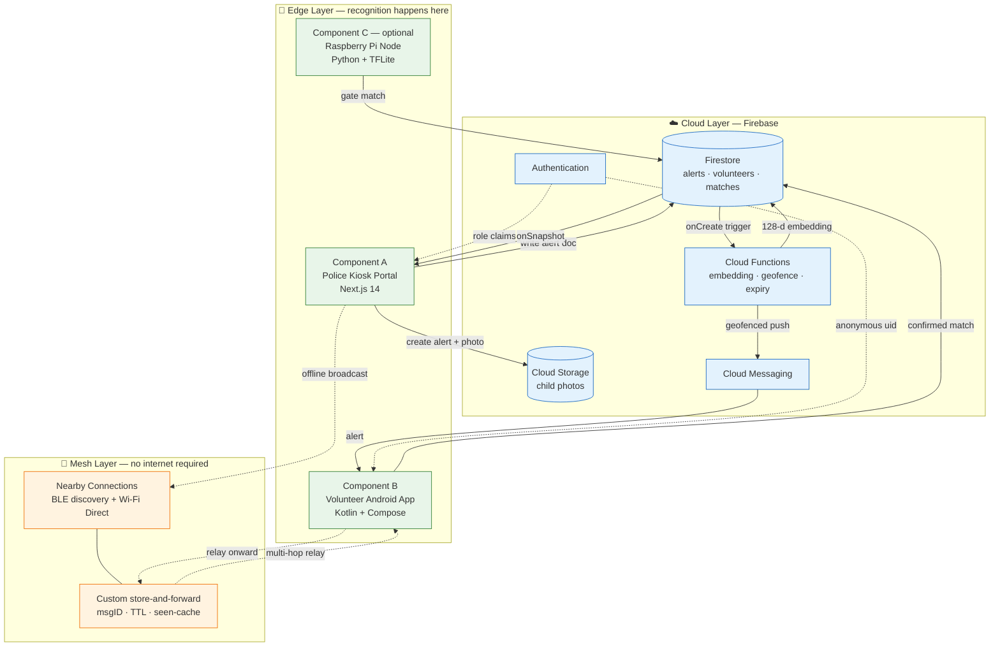
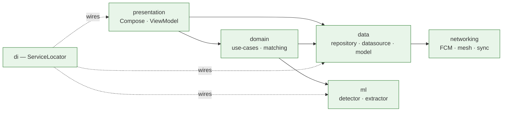
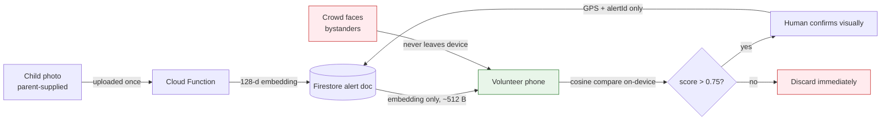

# Week 2 — Track 1: System Architecture & Technology Stack

**Project:** NextGen Rakshak: Smart Edge-Based Lost Child Recovery System for Mass Gatherings
**Member:** Bankar Smitraj Dinkar
**Roll No.:** 09
**Week of:** `____________ to ____________`
**Objective supported:** Objective 1 (hybrid edge-AI system), Objective 4, Objective 5

---

## 1. Scope of this track

Define the overall system architecture from the Week 1 research findings:
identify the core components, assign responsibilities to each, decide where
computation physically happens, and finalise the technology stack with pinned
versions so the other three tracks have a stable foundation to design against.

---

## 2. Architectural principle

The Week 1 research established that festival-grade crowds saturate cellular
networks precisely during the golden hour, and that centralised, cloud-based face
recognition (as used by ReUnite via Amazon Rekognition) creates both a
connectivity dependency and a privacy exposure.

The architecture therefore commits to two rules:

1. **Recognition never leaves the device.** No image, video frame, or biometric
   fingerprint of a bystander is uploaded. The cloud sees only the missing
   child's own photo (supplied by the parent) and its derived embedding.
2. **The cloud is a coordinator, not a dependency.** If the internet fails, the
   mesh layer must carry alerts unaided.

## 3. High-level architecture

The system is organised into three layers.

### Layer responsibilities

| Layer | Responsibility | Fails gracefully? |
|-------|----------------|-------------------|
| Cloud | Case management, alert distribution, one-time embedding computation, scheduled expiry | Yes — mesh takes over |
| Edge | **All** face detection and recognition; human confirmation | N/A — this is the core |
| Mesh | Alert propagation when cellular is saturated | Yes — FCM takes over when online |

Both distribution paths run **simultaneously**, not as a failover chain. Whichever
reaches a volunteer first wins; the receiving device de-duplicates by alert ID.

---

## 4. Component design

### Component A — Police Kiosk Portal (Next.js)

Deployed on a tablet or laptop at a festival police-assistance booth.

| Layer | Technology | Role |
|-------|-----------|------|
| Frontend | Next.js 14 (App Router), React 18, TypeScript, Tailwind + shadcn/ui | Server-rendered UI in any browser |
| Backend | Firebase Firestore / Auth / Storage / Functions | Realtime DB, role auth, photo storage |
| Realtime | Firestore `onSnapshot` listeners | Match feed updates in 1–2 s |
| Push | Firebase Cloud Messaging | Geofenced alert delivery |

### Component B — Volunteer Android Application (Kotlin)

| Layer | Technology | Role |
|-------|-----------|------|
| Language | Kotlin (coroutines) | Null-safe, concise async |
| UI | Jetpack Compose + ViewModel + Navigation | Declarative UI, clean state |
| Camera | CameraX | Consistent across OEMs |
| Detection | Google ML Kit Face Detection | Offline, ~30 FPS, head-pose angles |
| Recognition | TensorFlow Lite (MobileFaceNet) | 128-d embedding, <1M params |
| Scoring | Cosine similarity | Robust to lighting/pose |
| Mesh | Nearby Connections + custom routing | Offline multi-hop relay |
| Local store | Room + WorkManager | Queue matches offline, sync later |

Architecture follows a clean, SOLID-aligned package split so each concern is
independently testable:

Dependencies point **inward** — `presentation` and `data` depend on `domain`
abstractions, never the reverse. Dependency injection is manual via a
`ServiceLocator` object, avoiding the build-time cost of Hilt on a student
project while keeping construction in one place.

### Component C — Raspberry Pi Node (optional extension)

A Pi 4 (4 GB) + Camera Module V2 at an exit gate running the same
detection-and-matching pipeline unattended. Polls the kiosk for active alert
embeddings and POSTs matches back. Scheduled last; implemented only if time
allows.

---

## 5. Where computation happens — the key design decision

Only the **missing child's** embedding travels the network. Bystander faces are
processed in memory on the volunteer's phone and discarded. This is what allows
the privacy-by-design claim to hold structurally rather than by policy.

---

## 6. Finalised technology stack

| Layer | Technology | Version pinned |
|-------|-----------|----------------|
| Web portal | Next.js | `14.2.5` |
| Web language / styling | TypeScript · Tailwind CSS | `5.5.4` · `3.4.7` |
| Web UI kit | shadcn/ui + React | React `18.3.1` |
| Web SDK | Firebase JS SDK | `10.12.4` |
| Mobile language | Kotlin (AGP `8.5.0`) | `1.9.24` |
| Mobile UI | Jetpack Compose BOM | `2024.06.00` (compiler `1.5.14`) |
| Camera | AndroidX CameraX | `androidx.camera:camera-camera2:1.3.4` |
| Face detection | ML Kit Face Detection | `com.google.mlkit:face-detection:16.1.7` |
| Face recognition | TensorFlow Lite | `org.tensorflow:tensorflow-lite:2.16.1` |
| TFLite helpers | TensorFlow Lite Support | `0.4.4` |
| Offline mesh | Play services Nearby | `com.google.android.gms:play-services-nearby:19.3.0` |
| Local persistence | Room + WorkManager (KSP `1.9.24-1.0.20`) | AndroidX |
| Cloud Functions runtime | Node.js | `20` |
| Cloud Functions SDK | firebase-functions · firebase-admin | `5.0.1` · `12.2.0` |
| Server-side inference | `@tensorflow/tfjs-node` · `@tensorflow-models/blazeface` | `4.20.0` · `0.1.0` |
| Pi node (optional) | Raspberry Pi OS Lite, Python 3.9+, OpenCV, TFLite Runtime | — |
| Version control | Git + GitHub | feature-branch workflow |

> **Note on version drift:** the original synopsis listed ML Kit `16.1.5`,
> TensorFlow Lite `2.14.0`, CameraX `1.3.0`, and Nearby `18.7.0`. During stack
> finalisation these were moved to the current stable releases shown above.
>
> This table records the stack **as selected in Week 2**. Several versions were
> raised again in Week 3 — the TensorFlow Lite runtime was replaced by LiteRT and
> the Kotlin toolchain upgraded, to satisfy Android 15's 16 KB page-size
> requirement. See `docs/week-3/README.md` §7 for the current versions and the
> reason for each change.

### Selection rationale

- **Next.js over plain React** — server rendering and API routes in one project;
  the kiosk runs on whatever browser the police booth already has.
- **Kotlin + Compose over Java + XML** — coroutines make the camera/ML pipeline
  readable off the main thread; Compose removes layout boilerplate.
- **ML Kit for detection, TFLite for recognition** — ML Kit is fast and free for
  bounding boxes and head-pose, but does not do identity matching; MobileFaceNet
  supplies the discriminative 128-d embedding.
- **Nearby Connections over raw BLE** — supersedes the Week 1 plain-BLE proposal.
  BLE alone caps out at tiny payloads and slow throughput; Nearby negotiates
  BLE for discovery then upgrades to Wi-Fi Direct for transfer, and handles
  encryption and connection management for us. Multi-hop routing remains our
  responsibility (see Track 2).
- **Firebase over a custom backend** — free tier, realtime listeners out of the
  box, and no server for the team to operate during a demo.

### Cross-component constants

These values are mirrored in more than one codebase and must be changed together:

| Constant | Value | Appears in |
|----------|-------|-----------|
| Face-match threshold | cosine > 0.75 | Android, (Pi) |
| Embedding size | 128-d | Android, Cloud Function |
| Face input | 112×112 RGB, `(px − 127.5)/127.5` | Android, Cloud Function |
| Alert expiry | 8 hours | Android mesh, Cloud Function |
| Geofence radius | 2 km | Cloud Function |
| Mesh initial TTL | 6 hops | Android |

---

## 7. Deliverables

- [x] Three-layer architecture diagram (cloud / edge / mesh)
- [x] Component responsibility matrix with failure behaviour
- [x] Android package architecture with dependency direction
- [x] Computation-placement decision documented and justified
- [x] Technology stack finalised with pinned versions and rationale
- [x] Cross-component constant table

## 8. Risks identified

| Risk | Mitigation |
|------|-----------|
| MobileFaceNet weights are licensed and large | Not committed to Git; generated via a conversion script producing both the Android `.tflite` and the server model from one source so embeddings stay comparable |
| Nearby Connections is not a mesh protocol | Application-level routing layer specified in Track 2 |
| Firebase free-tier quota during demo | Alert payloads kept under 1 KB; photos never sent over mesh |

## 9. Handover to other tracks

- Track 2 specifies the protocols on the arrows drawn in §3.
- Track 3 designs the Firestore collections the cloud layer stores.
- Track 4 designs screens against Components A and B defined here.
