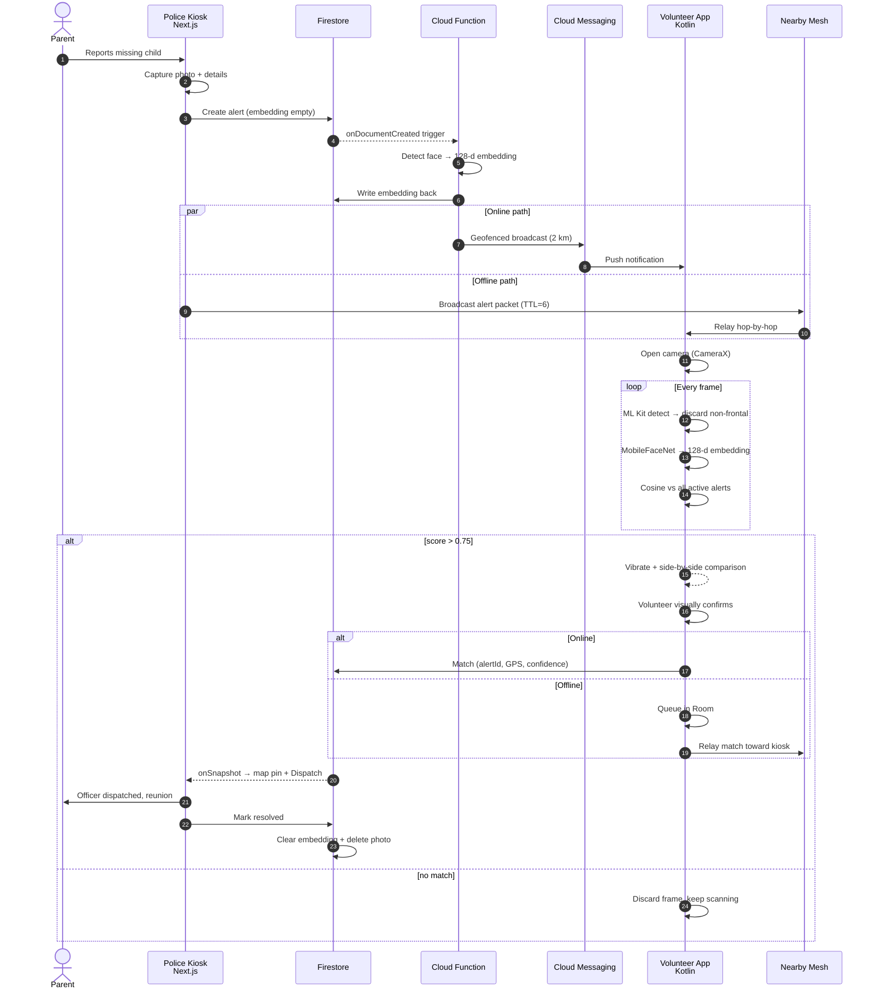
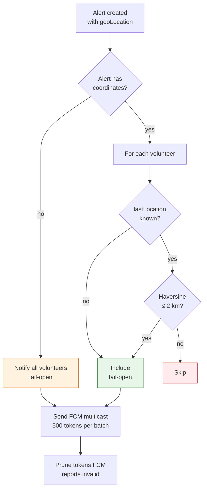
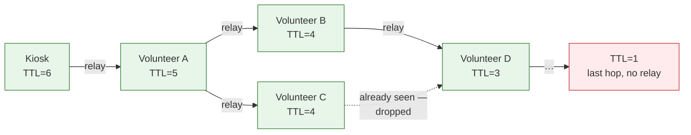
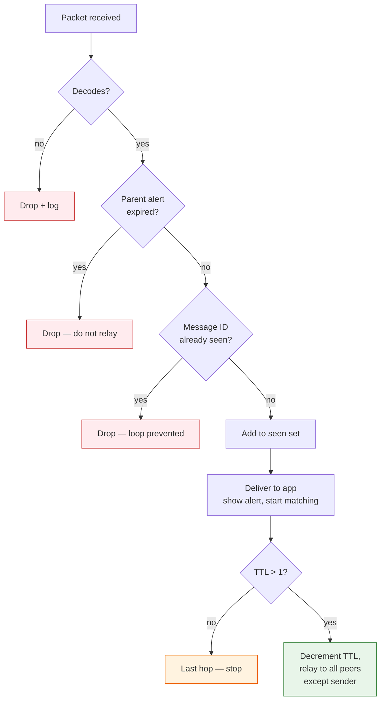
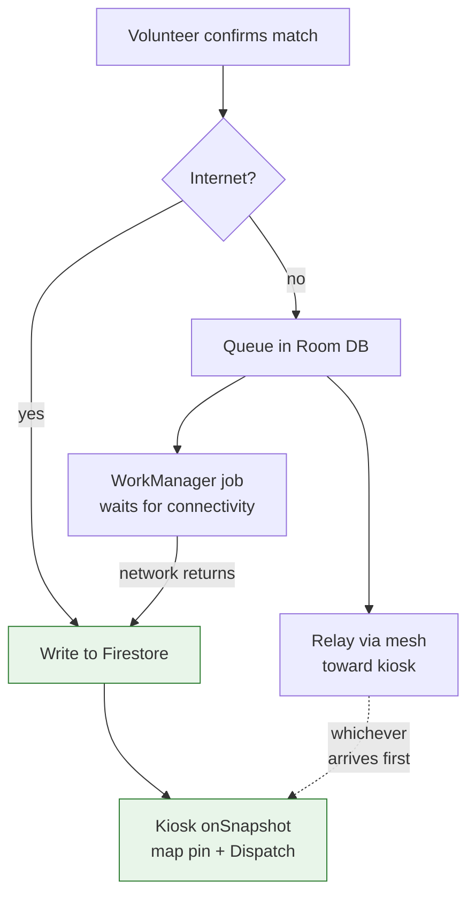

# Week 2 — Track 2: Interaction Flow & Communication Protocols

**Project:** NextGen Rakshak: Smart Edge-Based Lost Child Recovery System for Mass Gatherings
**Member:** Bhakare Tanishka Sharad
**Roll No.:** 11
**Week of:** `____________ to ____________`
**Objective supported:** Objective 1, Objective 3 (FCM + offline mesh)

---

## 1. Scope of this track

Document how the three components defined in Track 1 actually talk to each
other: the online alert-propagation path via Firebase Cloud Messaging, the
offline path via Nearby Connections, and — the part that does not come for free —
the custom multi-hop store-and-forward routing layer that makes a
device-to-device API behave like a venue-wide mesh.

---

## 2. Communication protocol summary

| # | From → To | Transport | Payload | When |
|---|-----------|-----------|---------|------|
| 1 | Kiosk → Cloud Storage | HTTPS | Child photo (JPEG) | Alert creation |
| 2 | Kiosk → Firestore | HTTPS / gRPC | Alert document | Alert creation |
| 3 | Firestore → Cloud Function | Internal trigger | `onCreate` event | Automatic |
| 4 | Cloud Function → Firestore | Admin SDK | 128-d embedding | After inference |
| 5 | Cloud Function → Volunteer | FCM push | `alertId`, `childName` | Geofenced, < 5 s |
| 6 | Kiosk → Volunteer | Nearby Connections | Alert packet < 1 KB | Offline, simultaneous |
| 7 | Volunteer → Volunteer | Nearby Connections | Relayed packet | Multi-hop, < 30 s |
| 8 | Volunteer → Firestore | HTTPS | Match document | On confirmation |
| 9 | Volunteer → Room (local) | SQLite | Queued match | When offline |
| 10 | Firestore → Kiosk | `onSnapshot` listener | Match document | Realtime, 1–2 s |

Paths 5 and 6 run **in parallel**, not as a failover chain — whichever arrives
first wins, and the receiver de-duplicates by alert ID.

---

## 3. End-to-end interaction flow



---

## 4. Online path — Firebase Cloud Messaging

### Geofencing

The synopsis scopes alerts to roughly a 2 km radius around the reporting kiosk.
This is enforced server-side, not on the device — an out-of-range phone is never
woken at all, which saves its battery and avoids alert fatigue.



**Fail-open is deliberate.** If we do not know where a volunteer is, or the alert
has no coordinates, we notify rather than skip. A missed nearby helper costs a
child; an unnecessary notification costs one buzz.

**Target:** < 5 seconds end-to-end (NFR-04).

---

## 5. Offline path — Nearby Connections + custom routing

### 5.1 What the API does and does not give us

Google Nearby Connections establishes authenticated, encrypted links between
nearby devices, automatically using **BLE for low-power discovery** and upgrading
to **Wi-Fi Direct for high-speed transfer**. It supersedes the plain-BLE approach
considered in Week 1, which was limited to tiny payloads and slow throughput.

But it is critical to be precise: **Nearby Connections is not a mesh-routing
protocol.** It connects a device to its immediate neighbours (a `P2P_CLUSTER`).
Reaching a volunteer three or ten hops across a festival ground is the
application's own responsibility. That routing layer is this track's core
contribution.

### 5.2 Routing controls

| Control | Purpose |
|---------|---------|
| Message ID (UUID) | Uniquely identifies a packet across every hop |
| Hop-count / TTL | Decremented at each relay; at zero the packet stops. Caps flood radius |
| Duplicate suppression | Each device keeps a seen-ID set and relays a given packet at most once |
| Expiration check | A packet whose parent alert has expired is dropped, not relayed |
| Payload minimisation | Embedding + text only, < 1 KB. The full photo is never sent |
| Transport security | Nearby encrypts the link; payloads are additionally signed so a relay cannot tamper with alert content |

Together these prevent the two classic flooding failures: **infinite loops**
(solved by the seen-ID cache) and **unbounded broadcast storms** (solved by TTL).

### 5.3 Multi-hop propagation



Volunteer D receives the packet twice — once from B, once from C. The second copy
is silently dropped because D's seen-ID set already contains that message ID.
This is what keeps a dense crowd from melting into a broadcast storm.

### 5.4 Relay decision logic



Note the packet is delivered to the local app **before** the relay decision — a
device at the last hop still shows the alert, it simply does not forward it.

### 5.5 Wire format

```
┌────────┬────────┬───────────────────────────────────┐
│ byte 0 │ byte 1 │ payload                           │
│  TTL   │  type  │ id, name, age, gender, clothing,  │
│        │ 01/02  │ embedding[128], timestamp         │
└────────┴────────┴───────────────────────────────────┘
   ↑
   decremented in place on relay — payload is never re-serialised
```

Placing TTL in byte 0 means a relaying device rewrites a single byte and forwards
the original bytes. It never has to decode, mutate, and re-encode the packet,
which keeps every hop cheap.

**Target:** < 30 seconds across the mesh (NFR-05).

---

## 6. Match return path and offline resilience

A confirmed match must reach the kiosk even if the reporting volunteer has no
signal at the moment of confirmation.



Three independent delivery attempts — direct write, mesh relay, and deferred
WorkManager sync — so a confirmed sighting is not lost to a dead zone.

---

## 7. Failure modes considered

| Failure | System behaviour |
|---------|-----------------|
| Cellular saturated at the venue | Mesh path carries alerts; FCM path simply never completes |
| Volunteer out of mesh range and offline | Receives nothing until either path reaches them — accepted limitation |
| Duplicate alert via both FCM and mesh | De-duplicated by alert ID at the receiving device |
| Relay device tampering with a packet | Payloads signed; Nearby link is encrypted |
| Broadcast storm in a dense crowd | TTL cap + seen-ID suppression |
| Stale alert circulating after reunion | Expiry check drops it at every hop |
| Volunteer confirms, then loses signal | Room queue + WorkManager retry |

---

## 8. Deliverables

- [x] Inter-component communication protocol table (10 paths)
- [x] End-to-end sequence diagram covering online and offline branches
- [x] FCM geofencing decision flow with fail-open policy
- [x] Mesh routing control specification (message ID, TTL, seen-cache, expiry)
- [x] Multi-hop propagation diagram with duplicate suppression
- [x] Relay decision flowchart
- [x] Wire format with TTL placement rationale
- [x] Match return path with three-way delivery resilience
- [x] Failure-mode analysis

## 9. Why this satisfies Objective 3

Objective 3 requires alert distribution over **both** internet push and a fully
offline multi-hop mesh. The FCM path is specified in §4 with a 2 km geofence and
a < 5 s target. The offline path is specified in §5 — and critically, it does not
assume Nearby Connections provides mesh routing. The store-and-forward layer with
message IDs, TTL, duplicate suppression, and expiry is what turns a
neighbour-to-neighbour API into venue-wide propagation, which is the piece that
keeps the system working when festival crowds saturate the cellular network.
