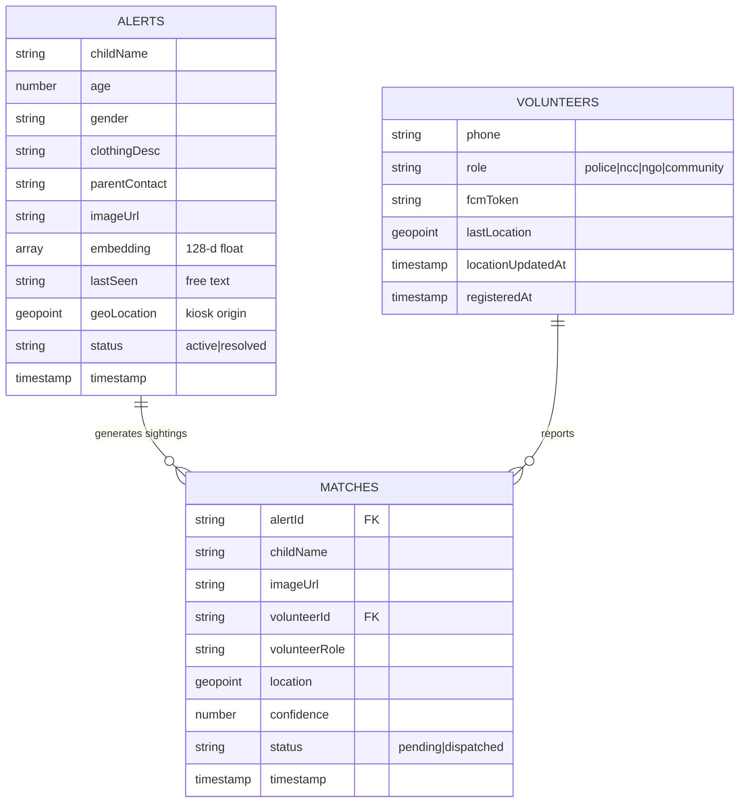
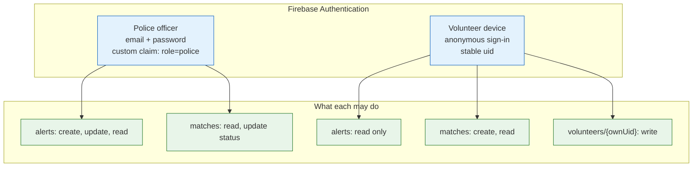
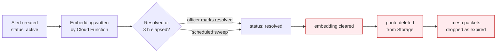

# Week 2 — Track 3: Firestore Database Schema & Security Model

**Project:** NextGen Rakshak: Smart Edge-Based Lost Child Recovery System for Mass Gatherings
**Member:** Dhadge Vedant Sanjay
**Roll No.:** 34
**Week of:** `____________ to ____________`
**Objective supported:** Objective 4, Objective 7 (privacy-by-design)

---

## 1. Scope of this track

Plan the Firebase Firestore data model — the `alerts`, `volunteers`, and
`matches` collections plus the user-role model — and define the security-rule
strategy and data-lifecycle policy that make the project's privacy claim
enforceable at the database level rather than by convention.

---

## 2. Entity relationship model

The model is deliberately **denormalised**: a `matches` document copies
`childName` and `imageUrl` from its alert. This costs a few bytes but means the
kiosk's live-match feed renders from a single collection listener with no join
and no second round-trip — which matters when an officer is waiting.

---

## 3. Collection specifications

### 3.1 `alerts/{alertId}`

The missing-child case record. Created by the kiosk, read by every signed-in
device.

| Field | Type | Notes |
|-------|------|-------|
| `childName` | string | Displayed on every volunteer device |
| `age` | number | 0–18 |
| `gender` | string | `Male` \| `Female` \| `Other` |
| `clothingDesc` | string | Human search aid — works even if recognition fails |
| `parentContact` | string | Kiosk-only; never sent to volunteer devices |
| `imageUrl` | string | Cloud Storage download URL |
| `embedding` | array\<number\> | 128-d; written by Cloud Function, empty at creation |
| `lastSeen` | string | Free-text landmark, e.g. "near Gate 3 food court" |
| `geoLocation` | geopoint | Kiosk coordinates — drives the 2 km geofence |
| `status` | string | `active` \| `resolved` |
| `timestamp` | timestamp | Server time; drives expiry and elapsed-time display |

`embedding` is intentionally written **after** creation by a Cloud Function
rather than by the client: the kiosk browser has no model, and computing it
server-side once guarantees every device compares against an identical vector.

### 3.2 `volunteers/{uid}`

Document ID **is** the Firebase Auth uid. This is what allows the security rule
`request.auth.uid == uid` to work without a lookup.

| Field | Type | Notes |
|-------|------|-------|
| `phone` | string | Registration identity |
| `role` | string | `police` \| `ncc` \| `ngo` \| `community` |
| `fcmToken` | string | Push target; cleared when FCM reports it invalid |
| `lastLocation` | geopoint | Last known position, for geofencing |
| `locationUpdatedAt` | timestamp | Staleness signal for the location |
| `registeredAt` | timestamp | Server time |

### 3.3 `matches/{matchId}`

A volunteer-confirmed sighting. Created by the app (or replayed from the offline
queue), read and updated by the kiosk.

| Field | Type | Notes |
|-------|------|-------|
| `alertId` | string | Reference to the alert |
| `childName`, `imageUrl` | string | Denormalised for single-listener rendering |
| `volunteerId` | string | Auth uid of the reporter |
| `volunteerRole` | string | Lets the officer weigh credibility at a glance |
| `location` | geopoint | Where the sighting happened |
| `confidence` | number | Cosine score, 0–1 |
| `status` | string | `pending` \| `dispatched` |
| `timestamp` | timestamp | Server time |

---

## 4. Role model

Two distinct role concepts, deliberately kept separate:

- **Auth-level role** (`police` custom claim) gates who may create alerts.
- **Volunteer category** (`role` field: NCC, NGO, police, community) is
  descriptive metadata shown to the dispatching officer. It carries no
  permissions.

### Design decision — why there is no separate `roles` collection

The initial plan listed user roles as a fourth collection. During schema design
we rejected that in favour of the two-mechanism model above, for three reasons:

1. **A role stored in a Firestore document cannot gate access to that same
   database.** Security rules would have to read the role document on every
   request — an extra read per operation, and a circular dependency (you need
   permission to read the roles collection to find out your permissions).
   Firebase Auth **custom claims** are carried inside the ID token itself, so
   `request.auth.token.role == "police"` is evaluated with no lookup and no cost.
2. **A separate collection is a privilege-escalation surface.** If roles live in
   a document, any write path to that document is a path to granting oneself
   police rights. Custom claims can only be set by the Admin SDK server-side.
3. **The volunteer category is not a permission.** NCC / NGO / police /
   community only tells the officer how much weight to give a sighting, so it
   belongs on the volunteer's own profile document, not in an access-control
   collection.

The role requirement is therefore fully satisfied — split across Firebase Auth
custom claims (authorisation) and the `volunteers.role` field (classification)
rather than a standalone collection.

Volunteers authenticate **anonymously**. This is a privacy decision, not a
shortcut: it gives each device a stable uid so rules can require
`request.auth != null` and scope writes to the device's own document, without the
system ever holding a volunteer's identity credentials.

## 5. Security-rule strategy

| Collection | Read | Create | Update | Delete |
|-----------|------|--------|--------|--------|
| `alerts` | any signed-in | kiosk | kiosk (status/embedding) | never |
| `matches` | any signed-in | any signed-in volunteer | kiosk (status) | never |
| `volunteers/{uid}` | any signed-in | own uid only | own uid only | never |

Two invariants:

1. **No client may delete anything.** Removal is the scheduled cleanup
   function's job, so a compromised device cannot destroy case history.
2. **A volunteer may only write their own profile document** — enforced by
   `request.auth.uid == uid`, which is why the uid is the document ID.

---

## 6. Data lifecycle and privacy

This is where the privacy claim becomes structural.

| Policy | Rule |
|--------|------|
| Alert lifetime | 8 hours from creation (configurable), then auto-resolved |
| Embedding retention | Cleared on resolution — the biometric vector does not outlive the case |
| Photo retention | Deleted from Cloud Storage on resolution |
| Bystander data | **Never written.** Crowd faces are processed in device memory and discarded; nothing about them reaches Firestore |
| Parent contact | Stored on the alert but never included in the volunteer push payload or the mesh packet |

The last two rows are the substance of Objective 7: the database physically has
no column in which a bystander's biometric data could be stored.

---

## 7. Indexes and query patterns

| Query | Used by | Index |
|-------|---------|-------|
| `status == "active"` ordered by `timestamp` desc | Kiosk dashboard, volunteer home | Composite |
| `status == "active"` AND `timestamp < cutoff` | Scheduled expiry sweep | Composite |
| `matches` ordered by `timestamp` desc | Kiosk live feed | Single-field |

Concurrent-alert target is 50 (NFR-07); at that scale the volunteer app holds all
active alert embeddings in memory and compares locally, so no per-face query
reaches Firestore.

---

## 8. Payload budget

A design constraint inherited from the mesh layer (Track 2): the alert must
survive being transmitted over a peer-to-peer link.

| Item | Size |
|------|------|
| 128-d float embedding | ~512 B |
| Text fields (name, age, gender, clothing, id) | ~200 B |
| **Total mesh packet** | **< 1 KB** |
| Nearby Connections limit | 32 KB |

The full-resolution photo is **excluded** from the mesh packet by design — only
its embedding travels offline. The photo is fetched over the internet if and when
available.

---

## 9. Deliverables

- [x] Entity-relationship diagram for all three collections
- [x] Field-level specification with types and rationale
- [x] Role model separating auth permissions from descriptive volunteer category
- [x] Security-rule matrix with two stated invariants
- [x] Data-lifecycle and retention policy
- [x] Index plan mapped to actual query patterns
- [x] Mesh payload budget

## 10. Handover

Field names here are the contract for Track 4's screens and Track 2's mesh
serialisation. Any field added later must be added to the codec in Track 2 or it
will not survive the offline path.
