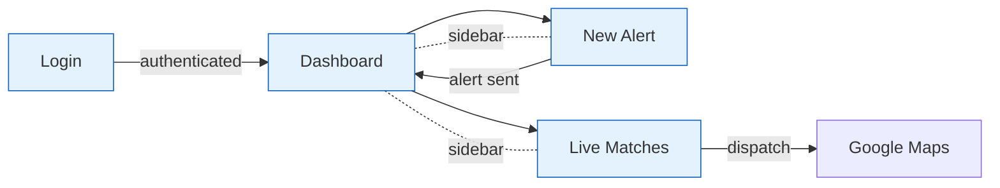
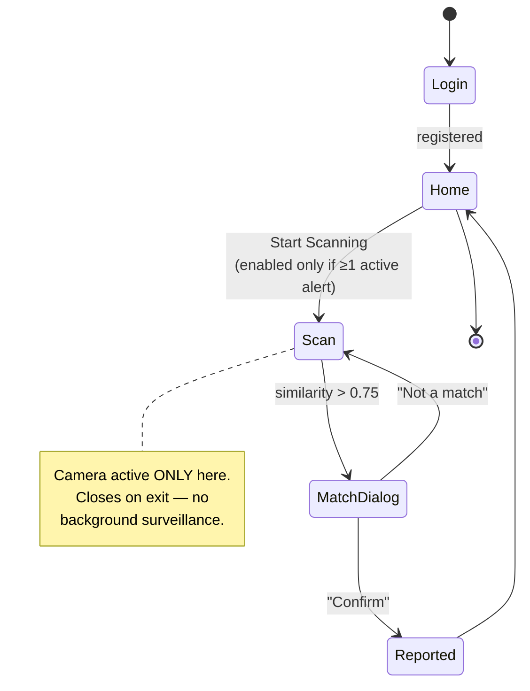

# Week 2 — Track 4: UI/UX Wireframes

**Project:** NextGen Rakshak: Smart Edge-Based Lost Child Recovery System for Mass Gatherings
**Member:** Narkhede Atharva Anantkumar
**Roll No.:** 94
**Week of:** `____________ to ____________`
**Objective supported:** Objective 4 (kiosk portal), Objective 5 (volunteer app)

---

## 1. Scope of this track

Design the screen-level wireframes for both user-facing applications defined in
Track 1 — the Police Kiosk Portal and the Volunteer Android Application —
including navigation flow, screen states, and the interaction constraints imposed
by the deployment context.

---

## 2. Design constraints from the problem domain

The operating environment drives every layout decision:

| Constraint | Consequence for the UI |
|-----------|------------------------|
| Officer is under pressure from a distressed parent | Alert creation must be one screen, no wizard, no optional steps |
| Volunteer is walking through a dense moving crowd | One-handed operation; the scan screen is a single full-bleed camera view |
| Outdoor daylight, glare | High contrast, large type, no thin grey-on-grey text |
| The system must never auto-declare a child found | Confirmation is an explicit, deliberate two-button choice |
| Battery is scarce at a day-long event | Camera opens only after an alert; no passive background scanning UI |

---

## 3. Police Kiosk Portal — wireframes

### 3.1 Navigation flow



### 3.2 Login

```
┌──────────────────────────────────────────────┐
│                                              │
│              🛡  NextGen Rakshak              │
│           Police Kiosk — Sign In             │
│                                              │
│     ┌────────────────────────────────┐       │
│     │ Email                          │       │
│     └────────────────────────────────┘       │
│     ┌────────────────────────────────┐       │
│     │ Password                       │       │
│     └────────────────────────────────┘       │
│                                              │
│     ┌────────────────────────────────┐       │
│     │           Sign In              │       │
│     └────────────────────────────────┘       │
│                                              │
│   Authorised personnel only. All alert       │
│   activity is logged.                        │
└──────────────────────────────────────────────┘
```

### 3.3 Dashboard

```
┌────────────┬─────────────────────────────────────────────┐
│            │  Dashboard                                  │
│  🛡 Rakshak │                                             │
│            │  ┌───────────────┐  ┌───────────────┐        │
│ ▸ Dashboard│  │ 🔔 Active     │  │ 📍 Total      │        │
│ ▸ New Alert│  │    Alerts     │  │    Matches    │        │
│ ▸ Matches  │  │      3        │  │      7        │        │
│            │  └───────────────┘  └───────────────┘        │
│            │                                             │
│            │  Active Alerts                              │
│            │  ┌─────────────────────────────────────┐    │
│            │  │ [img] Priya · 5 yrs · 12 min ago    │    │
│            │  │       red frock       [Resolve]     │    │
│            │  ├─────────────────────────────────────┤    │
│            │  │ [img] Arjun · 7 yrs · 40 min ago    │    │
│            │  │       blue shirt      [Resolve]     │    │
│            │  └─────────────────────────────────────┘    │
│            │                                             │
│            │  [ + Create New Alert ]                     │
└────────────┴─────────────────────────────────────────────┘
```

Elapsed time is shown prominently on every alert card — the golden hour is the
metric that matters, so the officer should never have to compute it.

### 3.4 New Alert

```
┌────────────┬─────────────────────────────────────────────┐
│            │  New Missing-Child Alert                    │
│  🛡 Rakshak │                                             │
│            │  Child Photo                                │
│ ▸ Dashboard│  ┌──────┐  Upload a clear, front-facing      │
│ ▸ New Alert│  │  ⬆   │  photo. Used to compute the        │
│ ▸ Matches  │  │      │  face embedding.                   │
│            │  └──────┘                                   │
│            │                                             │
│            │  ┌─────────────┐  ┌─────────────┐           │
│            │  │ Child Name  │  │ Age         │           │
│            │  └─────────────┘  └─────────────┘           │
│            │  ┌─────────────┐  ┌─────────────┐           │
│            │  │ Gender    ▾ │  │ Parent Ph.  │           │
│            │  └─────────────┘  └─────────────┘           │
│            │  ┌───────────────────────────────┐          │
│            │  │ Clothing description          │          │
│            │  │                               │          │
│            │  └───────────────────────────────┘          │
│            │  ┌───────────────────────────────┐          │
│            │  │ Last seen location            │          │
│            │  └───────────────────────────────┘          │
│            │                                             │
│            │  [ Send Alert ]   [ Cancel ]                │
└────────────┴─────────────────────────────────────────────┘
```

Photo first, deliberately — it is the only field the recognition pipeline cannot
work without.

### 3.5 Live Matches

```
┌────────────┬─────────────────────────────────────────────┐
│            │  Live Matches                    ● live     │
│  🛡 Rakshak │                                             │
│            │  ┌─────────────────────────────────────┐    │
│ ▸ Dashboard│  │ [img] Priya            87% match    │    │
│ ▸ New Alert│  │ Volunteer: NCC cadet                │    │
│ ▸ Matches  │  │ 📍 18.5204, 73.8567 · 40 s ago      │    │
│            │  │ Status: pending                     │    │
│            │  │            [ Dispatch → Maps ]      │    │
│            │  ├─────────────────────────────────────┤    │
│            │  │ [img] Priya            81% match    │    │
│            │  │ Volunteer: shopkeeper               │    │
│            │  │ 📍 18.5211, 73.8570 · 3 min ago     │    │
│            │  │ Status: dispatched                  │    │
│            │  └─────────────────────────────────────┘    │
└────────────┴─────────────────────────────────────────────┘
```

The list is driven by a realtime listener — rows appear without a refresh.
"Dispatch" opens turn-by-turn directions to the reported coordinates.

---

## 4. Volunteer Android Application — wireframes

### 4.1 Navigation flow



### 4.2 Registration / Login

```
┌───────────────────────┐
│                       │
│      🛡 Rakshak        │
│   Volunteer Sign-In   │
│                       │
│  ┌─────────────────┐  │
│  │ Phone number    │  │
│  └─────────────────┘  │
│                       │
│  Role                 │
│  ┌─────────────────┐  │
│  │ NCC / NSS     ▾ │  │
│  └─────────────────┘  │
│                       │
│  ┌─────────────────┐  │
│  │    Register     │  │
│  └─────────────────┘  │
│                       │
│  We ask for Camera,   │
│  Location and Nearby  │
│  Devices permission—  │
│  each explained next. │
└───────────────────────┘
```

### 4.3 Home — active alerts

```
┌───────────────────────┐
│ 🛡 Rakshak      ● mesh │
├───────────────────────┤
│ Active Alerts (2)     │
│                       │
│ ┌───────────────────┐ │
│ │ [img] Priya       │ │
│ │ 5 yrs · Female    │ │
│ │ red frock         │ │
│ │ 12 min ago        │ │
│ └───────────────────┘ │
│ ┌───────────────────┐ │
│ │ [img] Arjun       │ │
│ │ 7 yrs · Male      │ │
│ │ blue shirt        │ │
│ │ 40 min ago        │ │
│ └───────────────────┘ │
│                       │
│ ┌───────────────────┐ │
│ │  ▶ Start Scanning │ │
│ └───────────────────┘ │
└───────────────────────┘
```

The mesh indicator in the header tells a volunteer they are still receiving
alerts even with no cellular bars — important for trust in a dead zone.

### 4.4 Scan

```
┌───────────────────────┐
│                       │
│   ╔═══════════════╗   │  ← live rear camera
│   ║               ║   │
│   ║   ┌─────┐     ║   │  ← ML Kit bounding box
│   ║   │ 😐  │     ║   │
│   ║   └─────┘     ║   │
│   ║               ║   │
│   ╚═══════════════╝   │
│                       │
│ ┌───────────────────┐ │
│ │ Scanning for      │ │
│ │ Priya, Arjun…     │ │
│ │ Faces checked: 34 │ │
│ └───────────────────┘ │
│                       │
│      [ Stop ]         │
└───────────────────────┘
```

### 4.5 Match confirmation

The most safety-critical screen in the system. It must make an incorrect
"Confirm" hard to press by accident, and it must never imply the system has
decided.

```
┌───────────────────────┐
│ ╔═══════════════════╗ │
│ ║ Possible Match —  ║ │
│ ║ Priya             ║ │
│ ║                   ║ │
│ ║ ┌──────┐ ┌──────┐ ║ │
│ ║ │parent│ │ live │ ║ │
│ ║ │photo │ │frame │ ║ │
│ ║ └──────┘ └──────┘ ║ │
│ ║                   ║ │
│ ║ Confidence  87%   ║ │
│ ║ 5 yrs · Female    ║ │
│ ║ red frock         ║ │
│ ║                   ║ │
│ ║ Is this the child?║ │
│ ║ Confirm alerts    ║ │
│ ║ police with your  ║ │
│ ║ location.         ║ │
│ ║                   ║ │
│ ║ [Not a match]     ║ │
│ ║          [Confirm]║ │
│ ╚═══════════════════╝ │
└───────────────────────┘
```

Design decisions:

- **Side-by-side comparison** — the parent-submitted photo next to the live
  captured frame. A single photo would ask the volunteer to trust the score;
  two photos let them judge for themselves.
- **Haptic cue** — the phone vibrates on match so the volunteer notices without
  staring at the screen while walking.
- **"Not a match" placed first** — the destructive-to-get-wrong action
  (Confirm) sits furthest from the thumb's resting position.
- **Confidence shown as a percentage, not a verdict** — the wording stays
  interrogative ("Is this the child?"), never declarative.

---

## 5. Accessibility and field-readability notes

- Minimum body text 16 sp / 16 px; alert names 20 sp+.
- Contrast ratio ≥ 4.5:1 against outdoor glare.
- Tap targets ≥ 48 dp on the Android app.
- Colour is never the sole signal — match status carries a text label as well as
  a badge colour.
- All copy in plain language; no technical terms ("embedding", "cosine") appear
  anywhere in the volunteer-facing UI.

---

## 6. Deliverables

- [x] Kiosk navigation flow diagram
- [x] Kiosk wireframes — Login, Dashboard, New Alert, Live Matches
- [x] Android navigation state diagram
- [x] Android wireframes — Login, Home, Scan, Match Confirmation
- [x] Design-constraint table derived from the deployment context
- [x] Accessibility and field-readability specification

## 7. Handover

Screen field lists were cross-checked against the Firestore schema in Track 3 so
that every field displayed has a source, and every stored field has somewhere to
be entered or shown.
