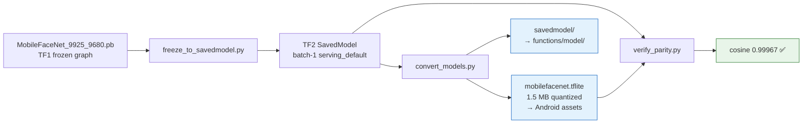
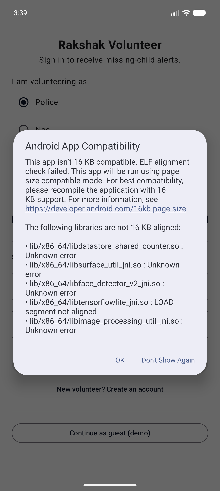
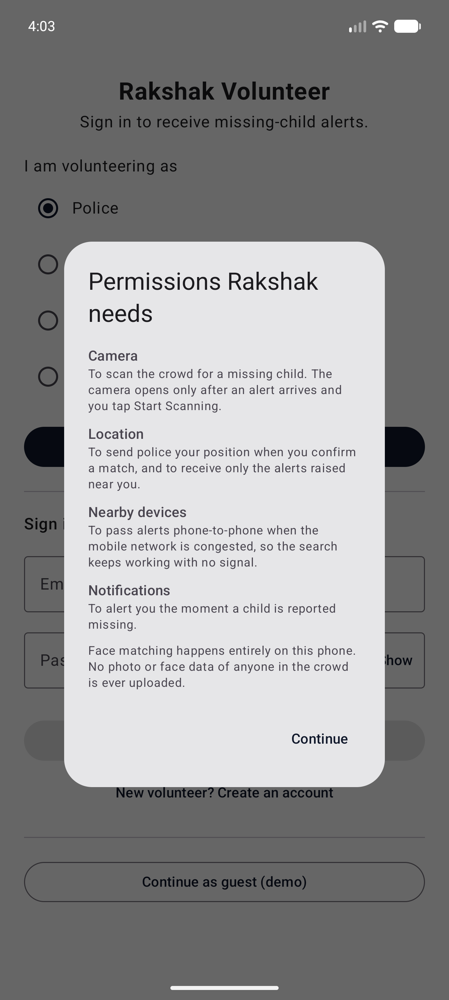

# Week 3 — Track 1: Face Recognition Model Pipeline & Build Infrastructure

**Project:** NextGen Rakshak: Smart Edge-Based Lost Child Recovery System for Mass Gatherings
**Member:** Bankar Smitraj Dinkar
**Roll No.:** 09
**Week of:** `____________ to ____________`
**Continues:** Week 2 Track 1 (System Architecture & Technology Stack)
**Objective supported:** Objective 2 (on-device detection and recognition in real time), Objective 8 (validating effectiveness rather than asserting it)

---

## 1. Scope of this track

Week 2 finalised the architecture and pinned a technology stack around a model
that did not yet exist. Closing that gap was the week's blocking dependency, and
it was large enough to be split four ways. This track owns the **first half of
the pipeline** — sourcing real MobileFaceNet weights and building the
reproducible conversion scripts that produce both the Android and the server
model from one source — plus the on-device recognition path and the Android
toolchain.

The other three halves of the model work are documented in their owners' tracks:

| Pipeline stage | Owner | Document |
|---|---|---|
| Weight sourcing, freeze + convert scripts, quantisation | **Bankar Smitraj (09)** | this document |
| Server-side SavedModel integration in the Cloud Function | Bhakare Tanishka (11) | [02-bhakare-tanishka-cloud-backend-and-mesh.md](02-bhakare-tanishka-cloud-backend-and-mesh.md) §6 |
| Parity verification of the quantized model against the source | Dhadge Vedant (34) | [03-dhadge-vedant-auth-and-data-lifecycle.md](03-dhadge-vedant-auth-and-data-lifecycle.md) §7 |
| 36-pair accuracy study and the threshold measurement | Narkhede Atharva (94) | [04-narkhede-atharva-ui-completion.md](04-narkhede-atharva-ui-completion.md) §5 |

---

## 2. The blocking dependency: no model weights

Until this week the system could not recognise anyone — the code was complete
but no embedding had ever been computed, because no weights were committed
(licensing and size, per the risk logged in Week 2 §8).

### 2.1 Source

| Property | Value |
|---|---|
| Source | [sirius-ai/MobileFaceNet_TF](https://github.com/sirius-ai/MobileFaceNet_TF) |
| File | `arch/pretrained_model/MobileFaceNet_9925_9680.pb` (~5.9 MB) |
| Licence | Apache-2.0 |
| Reported accuracy | 99.25% on the LFW benchmark (encoded in the filename) |
| Input | `img_inputs` `[-1, 112, 112, 3]` |
| Output | `embeddings` `[-1, 128]`, **already L2-normalized by the graph** |

Because every embedding is already a unit vector, cosine similarity reduces to
a plain dot product — no extra normalisation step needed on the device.

### 2.2 Conversion pipeline

Weights are **not committed** to the repository. They are regenerated by the
scripts below, so any team member can reproduce them. The two conversion stages
(`freeze_to_savedmodel.py`, `convert_models.py`) are this track's work;
`verify_parity.py` and the check it performs belong to Track 3, and the
`functions/model/` consumer belongs to Track 2:



```bash
pip install tensorflow
curl -L -o mobilefacenet.pb \
  https://raw.githubusercontent.com/sirius-ai/MobileFaceNet_TF/master/arch/pretrained_model/MobileFaceNet_9925_9680.pb
python scripts/freeze_to_savedmodel.py --pb mobilefacenet.pb --out ./mobilefacenet_savedmodel
python scripts/convert_models.py       --saved-model ./mobilefacenet_savedmodel
python scripts/verify_parity.py        --saved-model ./mobilefacenet_savedmodel
```

Dynamic-range quantisation shrinks the model from 5.9 MB to **1.5 MB** for the
phone — the artefact that ships in the Android assets. Whether that quantisation
damaged the embedding is not something this track asserts: it was checked
independently in Track 3, which measured the quantized model against the source
graph at **cosine 0.99967**.

### 2.3 Handover to the server track

The Week 2 design had the Cloud Function load a TensorFlow.js `GraphModel`
converted from the same weights. That route was abandoned during this week — the
reasoning and the replacement (loading the SavedModel directly, so device and
server run the identical graph) belong to **Track 2 §6**, which owns the Cloud
Function. What this track guarantees is the input to that decision: a single
SavedModel from which both artefacts are derived, so the two can never drift.

---

## 3. Adopting the measured threshold

This track did not measure the accuracy — Track 4 ran the 36-pair study on the
quantized `.tflite` produced here. What this track owns is the consequence: the
constant that the matcher actually uses.

The measurement showed same-person scores spanning 0.7142–0.9899 and
different-person scores spanning 0.0864–0.3551, an empty band from **0.3551 to
0.7142**. The Week 2 figure of 0.75 sits *above* that band, inside the
same-person range, and rejects genuine matches — 5 of 15 in the sample.

`Constants.SIMILARITY_THRESHOLD` was therefore changed from 0.75 to **0.55**,
near the middle of the empty band with roughly 0.19 of headroom on each side.
The asymmetry of the two error types justifies favouring the lower value: a
missed child is the precise failure this system exists to prevent, while a false
candidate costs only the moment a volunteer takes to tap "Not a match," and every
match is human-confirmed before it reaches police.

This supersedes the 0.75 figure carried in the Week 2 cross-component constant
table (§6 of Track 1). The constant's KDoc and `scripts/README.md` now carry the
value together with the evidence for it, so the next person to read the code
finds the measurement rather than an unexplained magic number. The measurement
itself is documented in **Track 4 §5**.

---

## 4. Defects found in the on-device recognition path

**The model was reloaded and leaked on every scan.** A new TFLite interpreter
was constructed each time the scan screen opened, so the model was re-read and
the previous interpreter abandoned (nothing closed it). Now a singleton, with
4 inference threads for the <200 ms budget and serialised access, since TFLite
interpreters are not thread-safe.

**Device-side crop geometry.** The device squashed a raw ML Kit detector box
into the square 112×112 input, so non-square boxes were distorted by an
aspect-dependent amount. The device now crops a square centred on the box with a
0.2 margin, held in `Constants.FACE_CROP_MARGIN`. This is one half of a parity
defect — the server framed faces differently again, using BlazeFace boxes; the
server half and the shared-constant agreement are covered in **Track 2 §6.1**.

---

## 5. Build infrastructure

The Android module had `gradle-wrapper.properties` but no `gradlew`,
`gradlew.bat`, or `gradle-wrapper.jar`, so it could only be built from Android
Studio — no command-line build, no CI, no way to run unit tests. The wrapper
(Gradle 8.14, from the official repository at tag `v8.14.0`) is now committed:

```bash
cd nextgen-rakshak-mobile
./gradlew :app:testDebugUnitTest   # compile + run unit tests
./gradlew :app:assembleDebug       # build the APK
```

### 5.1 16 KB page-size compliance

Android 15 warned on every launch that the app was not 16 KB compatible,
naming the native libraries whose ELF `LOAD` segments were aligned to 4 KB.
Devices with 16 KB memory pages otherwise fall back to a compatibility mode.

Alignment is a property of each dependency's prebuilt `.so`, so the fix was to
move to versions that ship aligned binaries: **datastore 1.1.7**, **CameraX
1.4.2**, and — for the last offender — replacing `org.tensorflow:tensorflow-lite`
with **`com.google.ai.edge.litert:litert:2.1.6`**, the current name for the same
runtime. It exposes the identical `org.tensorflow.lite.Interpreter` API, so no
application code changed.

LiteRT is built against Kotlin 2.3 metadata, which a 1.9 compiler cannot read,
so it pulled a toolchain upgrade with it — this **supersedes the stack table in
Week 2 Track 1 §6**:

| Component | Was (Week 2) | Now | Why |
|---|---|---|---|
| Kotlin | 1.9.24 | **2.3.21** | LiteRT's metadata version |
| Compose compiler | `composeOptions` setting | **`kotlin.plugin.compose`** | Separate plugin from Kotlin 2.0 |
| KSP | 1.9.24-1.0.20 | **2.3.10** | Must track Kotlin |
| AGP | 8.5.0 | **8.13.2** | KSP 2.3 needs `addKspConfigurations` |
| compileSdk | 34 | **35** | Required by AGP 8.13 dependencies |
| Room | 2.6.1 | **2.8.4** | KSP2 failed on the old compiler |

`tensorflow-lite-support` was dropped rather than upgraded: nothing used it,
and it pulled in the old `tensorflow-lite-api`, whose `org.tensorflow.lite.*`
classes collide with LiteRT's.

Compliance was verified by reading the `PT_LOAD` `p_align` field directly out
of the built APK rather than trusting the absence of a warning:

| ABI | Result |
|---|---|
| arm64-v8a | all 8 libraries **16384** ✅ |
| x86_64 | all 9 libraries **16384** ✅ |
| armeabi-v7a, x86 | ML Kit's face detector remains 4096 — harmless, as the 16 KB requirement applies only to 64-bit ABIs |

---

## 6. Verification evidence

**Build and tests**

| Check | Result |
|---|---|
| `./gradlew :app:testDebugUnitTest` | **BUILD SUCCESSFUL** — 13 tests, 0 failures |
| `./gradlew :app:assembleDebug` | **BUILD SUCCESSFUL** |

**Model artefacts produced by this track**

| Check | Result |
|---|---|
| Frozen `.pb` → TF2 SavedModel | batch-1 `serving_default` signature, converts cleanly |
| SavedModel → quantized `.tflite` | 5.9 MB → **1.5 MB** |
| Both artefacts derived from one SavedModel | yes — no second conversion to drift |

Independent verification of these artefacts is in **Track 3 §7** (parity, cosine
0.99967) and **Track 4 §5** (recognition accuracy on 36 real pairs). Splitting
production from verification was deliberate: the person who converts a model is
the worst person to certify that the conversion was lossless.

**16 KB page-size, before and after**

| Before | After |
|---|---|
|  |  |

The dialog named `libtensorflowlite_jni.so` as unaligned; after moving to
LiteRT it no longer appears.

---

## 7. Deliverables

- [x] Pretrained weight source identified, licensed for reuse, I/O contract documented
- [x] `freeze_to_savedmodel.py` + `convert_models.py` conversion pipeline
- [x] Quantized 1.5 MB `.tflite` for the device and the SavedModel for the server, both from one source
- [x] Threshold revised 0.75 → **0.55** in `Constants.SIMILARITY_THRESHOLD`, on Track 4's measurement, with the evidence recorded beside the constant
- [x] Device-side crop geometry fixed to a square crop, margin constant shared with the server
- [x] TFLite interpreter singleton (fixed reload/leak)
- [x] Gradle wrapper committed — CLI build restored
- [x] 16 KB page-size compliance on all 64-bit ABIs; Kotlin/AGP/KSP/Room toolchain upgraded

## 8. Remaining / handover

- **Inference time not yet measured on a physical device** — the <200 ms
  per-face target (NFR-03) is not yet evidenced. Follows directly from this
  track's ownership of the on-device recognition path.
- **NFR-10 drift:** synopsis states Android 5.0+ (API 21); the project sets
  `minSdk = 24`, forced by CameraX, LiteRT and Credential Manager. Needs
  correcting in the synopsis before submission.
- **No release build configuration** — no signing config, no R8, and the release
  SHA-1 is not registered, so only debug builds exist.

Two items that were previously carried here now sit with the tracks that own
them: server-side inference verification with **Track 2**, and the limits of the
accuracy sample with **Track 4**.
