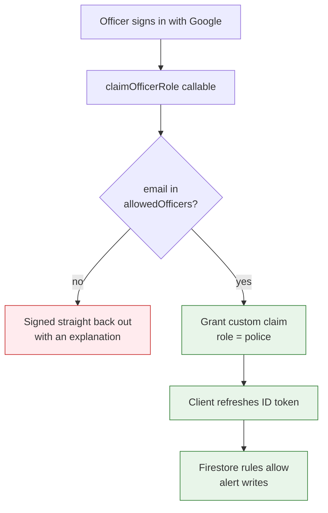
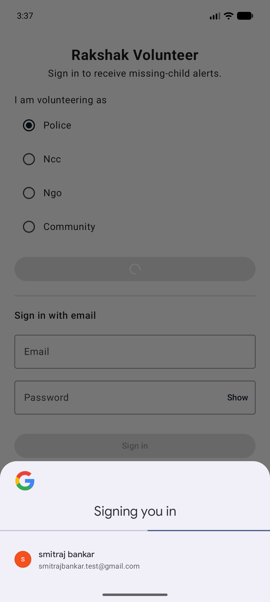
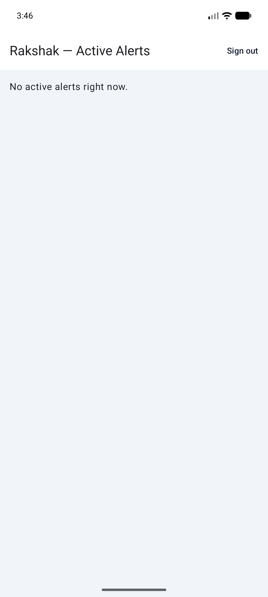

# Week 3 — Track 3: Authentication, Authorisation & Data Lifecycle

**Project:** NextGen Rakshak: Smart Edge-Based Lost Child Recovery System for Mass Gatherings
**Member:** Dhadge Vedant Sanjay
**Roll No.:** 34
**Week of:** `____________ to ____________`
**Continues:** Week 2 Track 3 (Firestore Database Schema & Security Model)
**Objective supported:** Objective 7 (privacy and trust by design), Objective 8
(validating effectiveness rather than asserting it — §7)

---

## 1. Scope of this track

Week 2 designed the Firestore schema and specified a role model — including,
in synopsis §6.1.1, a `role: police` custom claim gating writes to the
`alerts` collection. This week implements that security model for real,
closes the gap between "signed in" and "authorised" on both apps, and makes
the schema's data-retention promise (NFR-08) enforceable rather than a policy
statement.

This track also took the **verification stage of the face-recognition pipeline**
(§7). The model work was split four ways this week — Track 1 produced the weights
and the conversion scripts, Track 2 integrated the model server-side, Track 4
measured recognition accuracy, and this track certified that the quantized model
shipped to the phone still computes the same embedding as the source graph. That
separation is deliberate: the person who converts a model should not be the
person who signs off that the conversion was lossless.

---

## 2. Volunteer app — three sign-in routes

The app previously asked for a phone number in a text box and signed the
device in **anonymously**. A sighting sent to police therefore carried no
identity: nothing prevented one person registering repeatedly, and this is
incompatible with the "trusted, pre-registered volunteer" model the Week 2
schema's `volunteers` collection was designed around.

| Route | Identity | Implementation |
|---|---|---|
| **Continue with Google** | Verified account | Credential Manager — the current API; the deprecated `GoogleSignIn` client is not used. The Google ID token is exchanged for a Firebase session |
| **Email + password** | Verified account | Firebase Email/Password, including account creation for a volunteer issued no credentials |
| **Continue as guest** | Anonymous | Retained for demonstrations, labelled on screen as creating an account that cannot be traced back to the reporter |

For both verified routes the volunteer's name and email are stored with their
role and written to `volunteers/{uid}`, extending the Week 2 schema so every
match is attributable to a real account.

Firebase reports email failures as opaque codes such as
`ERROR_INVALID_CREDENTIAL`; these are translated into text a volunteer can act
on (wrong password, no such account, address already registered, password too
short) rather than shown raw.

**Sign-out existed but could not work.** It called `signOut()`, which clears
the stored profile asynchronously, and *immediately* navigated to the login
screen. The login screen still saw the previous volunteer and redirected
straight back to home, leaving the user on the home screen while signed out.
Navigation now reacts to the profile actually becoming null.

---

## 3. Police kiosk — authentication was not authorisation

Reviewing the kiosk against the Week 2 security-model spec surfaced the most
serious defect of the week.

The portal authenticated officers with Google but never checked **which**
account had signed in, so any account on the internet could reach the full
kiosk. Compounding it, `firestore.rules` permitted `alerts` create and update
to anyone satisfying `signedIn()` — including every volunteer device, since
the app signed in anonymously. The practical consequence: a volunteer's phone,
or any stranger with a Google account, could file fabricated missing-child
alerts or mark genuine ones resolved.

Synopsis §6.1.1 had already specified the remedy; it had simply never been
implemented. It now is:

| Principal | Signs in via | Permitted writes |
|---|---|---|
| Officer (kiosk) | Google **+** `allowedOfficers` entry → `police` claim | Create/resolve alerts; update match status |
| Volunteer (app) | Google (anonymous = demo fallback) | Own `volunteers/{uid}` doc; create matches |
| Any signed-in user | — | Nothing further; no client may delete anything |

Two design points, both schema decisions:

- **The allow-list is invisible to clients.** `allowedOfficers` denies all
  client read and write in `firestore.rules`; it is reachable only by the
  Admin SDK inside `claimOfficerRole`. A signed-in user can neither enumerate
  authorised officers nor add themselves.
- **The claim is re-checked on every auth state change,** not just at
  sign-in, so a session restored on page reload can't bypass the check.

Firestore rules are the enforcement boundary; the kiosk's UI check is a
convenience on top of it.

---

## 4. Data lifecycle — making NFR-08 real

Resolving an alert cleared the embedding but left the child's photo in Cloud
Storage indefinitely — the schema's retention story was a policy statement,
not an enforced behaviour. An `onAlertResolved` Firestore trigger now deletes
the photo and clears the embedding on the `active → resolved` transition,
covering both the officer's manual resolve and the scheduled expiry sweep, so
both routes share one cleanup path.

---

## 5. Defects found running the app on a device

**A Firestore permission error killed the whole app.** `FirestoreAlertSource`
called `close(error)` when its snapshot listener failed, which rethrows in
every collector; because the alert flow is collected in a ViewModel coroutine,
this took the process down on a `PERMISSION_DENIED`. At a festival, a dropped
connection or a rules change would kill the app **mid-search**. The listener
now logs and emits an empty list instead, so the mesh can still deliver alerts
when Firestore cannot.

**A stored profile could outlive its Firebase session.** The cause of that
permission error: the volunteer profile is persisted locally but the Firebase
session is not, so once the session was gone the app went straight to the
home screen and every read was rejected. The login view model now discards a
stored profile whose session no longer exists, sending the volunteer back to
sign in.

---

## 6. Verification evidence — Google sign-in, end to end on a device

With the OAuth client configured in Firebase, the full volunteer sign-in path
was exercised on a device for the first time:

| Step | Result |
|---|---|
| Tap "Continue with Google" | Credential Manager shows the system account picker |
| Choose an account | "Signing you in" — Google ID token returned |
| Token exchanged for a Firebase session | succeeded |
| App navigates to Home | "Rakshak — Active Alerts" renders, with "Sign out" in the app bar |
| Firestore read under the new rules | succeeded — "No active alerts right now", no `PERMISSION_DENIED`, no crash |

This is the first evidence that authentication, the Firestore rules from §3,
and the crash fix from §5 all hold together at runtime — before the fix this
same path terminated the process.

---

## 7. Model verification — proving quantisation did not damage the embedding

Track 1 shrinks the model from 5.9 MB to 1.5 MB with dynamic-range quantisation
before it ships in the Android assets. Quantisation trades numeric precision for
size, and the whole system rests on one assumption: that the phone's quantized
model and the server's full-precision model produce embeddings that can be
compared to each other. If quantisation shifted the embedding even slightly, the
device and the server would be measuring different things and every cosine score
in the system would be quietly wrong — against a fixed threshold, that is a
silent accuracy loss with no error to reveal it.

`verify_parity.py` makes that assumption testable. It runs one input through both
the quantized `.tflite` and the source SavedModel and asserts the two embeddings
agree above a 0.99 cosine floor.

| Check | Result |
|---|---|
| SavedModel output shape | `(1, 128)` |
| SavedModel output L2 norm | **1.000000** — the graph normalises its own output, so cosine similarity reduces to a dot product and the device needs no extra normalisation step |
| Quantized `.tflite` vs source SavedModel | **cosine 0.99967** against a 0.99 threshold |

The result is comfortably above the floor, so the 1.5 MB model on the phone is
interchangeable with the 5.9 MB graph on the server. This is what licenses Track
4 to measure accuracy on the **quantized** model and treat the number as valid
for the whole system.

The check is a script rather than a one-off measurement on purpose: it is
re-runnable, so any future change to the conversion pipeline can be re-certified
by whoever makes it.

---

## 8. Deliverables

- [x] Google + email/password + guest sign-in on the volunteer app, replacing
      untraceable anonymous sign-in
- [x] Sign-out navigation race fixed
- [x] `claimOfficerRole` callable + `allowedOfficers` allow-list implementing
      the Week 2 role model
- [x] `firestore.rules` gate alert/match writes on the `police` claim
- [x] `onAlertResolved` trigger enforcing NFR-08 photo/embedding deletion
- [x] Firestore listener crash fixed; stale-session defect fixed
- [x] Google sign-in verified end to end on a physical device
- [x] `verify_parity.py` certifying the quantized model against its source —
      cosine 0.99967, and the L2-normalised output contract confirmed

## 9. Remaining / handover

- Nobody can use the kiosk until at least one `allowedOfficers/{email}`
  document exists and the SHA-1 for Google sign-in is registered in Firebase —
  configuration, not code, but blocking for any demo.
- Email/password and guest routes are implemented but not yet exercised on a
  device; each needs its provider enabled in the Firebase console.
- **The Firestore rules have never been tested.** They are the enforcement
  boundary for the entire authorisation model and no negative test exists — that
  a volunteer *cannot* create an alert, that no client can delete, that
  `allowedOfficers` is unreadable. Emulator tests belong to this track.
- **NFR-08 is enforced in code but not evidenced.** "No biometric data leaves the
  phone" is the project's headline privacy claim; nothing has yet demonstrated it
  from the outside, e.g. by observing traffic during a scan session.
