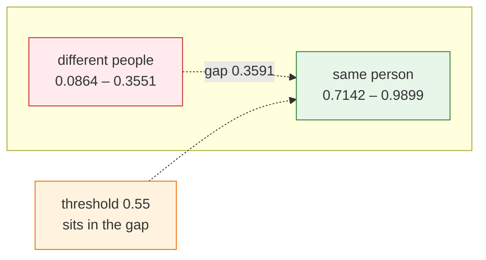

# Week 3 — Track 4: Volunteer App UI Completion

**Project:** NextGen Rakshak: Smart Edge-Based Lost Child Recovery System for Mass Gatherings
**Member:** Narkhede Atharva Anantkumar
**Roll No.:** 94
**Week of:** `____________ to ____________`
**Continues:** Week 2 Track 4 (UI/UX Wireframes)
**Objective supported:** Objective 5 (Kotlin volunteer app), Objective 8
(validating effectiveness rather than asserting it — §5)

---

## 1. Scope of this track

Week 2 produced wireframes for the volunteer app's four screens. This week
audits the built app screen by screen against those wireframes and synopsis
§6.2, and closes every gap between what was drawn and what actually shipped.

This track also took the **accuracy measurement** for the face-recognition
pipeline (§5). The model work was split four ways this week — Track 1 produced
the weights and the conversion scripts, Track 2 integrated the model server-side,
Track 3 certified the quantized model against its source, and this track measured
what the system actually recognises. It lands here because the number it produces
sets the threshold at which this track's match-confirmation dialog fires: the
measurement and the UI it drives are the same question asked twice.

---

## 2. Gaps closed against the Week 2 wireframes

| Requirement | Work done |
|---|---|
| §6.2.3 / FR-04 — discard non-frontal faces | The head-Euler check was specified but **never applied**: the detector captured only roll and the matcher ignored it entirely. Now captures **yaw** (the dominant frontality signal) and filters before embedding — limits 30° yaw / 40° roll |
| §6.2.3 — scan overlay | Camera now overlays "Scanning for \<names\>…", drawn from the Week 2 scan-screen wireframe |
| §6.2.4 / FR-07 — side-by-side comparison | Match dialog previously showed only the parent's photo. Now shows it beside the face captured live, each captioned, so the volunteer judges the images rather than trusting the score |
| §6.2.4 — vibrate on match | Added, as a double pulse distinct from a normal notification |
| §6.2.2 — time elapsed | Alert rows now show "12 min ago", refreshed every 30 s — the golden-hour clock was not previously on screen |
| §6.2.1 — permission rationale | Permissions were requested cold; a dialog now explains each one and states that matching is on-device and no bystander's face is uploaded, before the system prompt |

---

## 3. Defect found running the app on a device

**The heading was drawn under the camera cutout.** The activity draws edge to
edge, but the login screen — the first screen in the Week 2 wireframe set —
applied no window insets, so "Rakshak Volunteer" was sliced by the status bar
and the camera punch-hole. Fixed with `safeDrawing` insets.

---

## 4. Verification evidence — on device (emulator)

| Check | Result |
|---|---|
| Login screen layout | heading clear of the status bar and camera cutout |
| Permission rationale | shown before the system prompt on first launch |
| Scan overlay | "Scanning for \<names\>…" renders during an active scan |
| Match dialog | parent photo and live capture render side by side, captioned |

---

## 5. Measured recognition accuracy — and what it did to the threshold

The synopsis quoted 99.25% LFW accuracy and a 0.75 match threshold, both taken
from the literature before the team had a model to run. Rather than restate those
figures, this week measured them.

### 5.1 Method

Nine photographs of four people were assembled and run through the **actual
quantized `.tflite` that ships in the app** — not the source graph — using the
app's own crop geometry, so the measurement reflects what a volunteer's phone
really computes. Every photograph was compared against every other, giving
**36 pairs**: 15 of the same person, 21 of different people.

Two decisions make the number meaningful rather than decorative. Using the
quantized model means the figure applies to the shipped artefact, which Track 3's
parity check licenses. Using the app's crop geometry means a framing bug would
show up in the score rather than hide behind a favourable crop.

### 5.2 Result

| Group | Pairs | Cosine range |
|---|---|---|
| Same person | 15 | **0.7142 – 0.9899** |
| Different people | 21 | **0.0864 – 0.3551** |
| **Separation gap** | | **0.3591** |

The model separates identities cleanly: no different-person pair came close to
any same-person pair.

### 5.3 The threshold the synopsis specified was wrong

The two groups are separated by an empty band running from **0.3551 to 0.7142**.
Any threshold inside that band classifies all 36 pairs correctly. The synopsis
figure of 0.75 sits *above* the band — inside the same-person range — and
therefore rejects genuine matches:

| Threshold | False matches | Missed matches |
|---|---|---|
| 0.75 (as designed in Week 2) | 0 / 21 | **5 / 15** |
| **0.55 (recommended and adopted)** | **0 / 21** | **0 / 15** |

**0.55** was recommended to Track 1, which owns `Constants.SIMILARITY_THRESHOLD`,
and adopted there. It sits near the middle of the empty band with roughly 0.19 of
headroom on each side, so it tolerates harder pairs than this sample contains.

The choice of the lower value follows from this track's own UI design. Because
the match dialog requires the volunteer to visually confirm a candidate before
anything reaches police, a false positive costs exactly one tap on "Not a match".
A false negative costs a child. When the two error types are that asymmetric, the
threshold belongs at the safe end of the band — the human confirmation step is
what makes the cheap error cheap.

### 5.4 Limits of this measurement

Stated plainly, because it bounds what the project can claim: the sample is
**nine photographs of four adults** from a public source, in good lighting. It is
enough to show clean separation and to place the threshold on evidence. It is
**not** enough to support the synopsis KPI of ≥90% recognition accuracy on
children's faces under festival lighting (NFR-02), which remains unproven.

---

## 6. Deliverables

- [x] FR-04 frontal-face filter wired into the scan pipeline (yaw + roll)
- [x] "Scanning for…" overlay
- [x] Side-by-side match confirmation (FR-07)
- [x] Match haptics (double pulse)
- [x] "N min ago" elapsed-time label on alert rows, live-refreshed
- [x] Permission-rationale dialog before every system permission prompt
- [x] Window-inset fix on the login screen
- [x] 36-pair recognition accuracy study on the shipped quantized model, with
      the app's own crop geometry
- [x] Threshold 0.75 → **0.55** recommended on evidence and adopted in Track 1

## 7. Remaining / handover

- All four screens have only been exercised on one emulator profile. Not yet
  checked on a physical device or a second screen size — the natural next
  step for this track, continuing the wireframe-fidelity check into real
  hardware rather than one emulator image.
- **NFR-02 is unproven for the target population.** The accuracy measurement in
  §5 used adult faces in good lighting; the synopsis KPI is ≥90% on children's
  faces under festival lighting. Extending the study is this track's next
  measurement task, and sourcing children's photographs is an ethics question
  before it is a technical one — it needs starting early.
- No measurement yet of how the score degrades with distance, motion blur, or low
  light, all of which a festival guarantees.
- NFR-10 drift (synopsis says Android 5.0+/API 21, project sets `minSdk 24`)
  affects which devices these screens can even be tested on — tracked under
  Track 1's build-infrastructure handover, since it's a stack decision, not a
  layout one.
