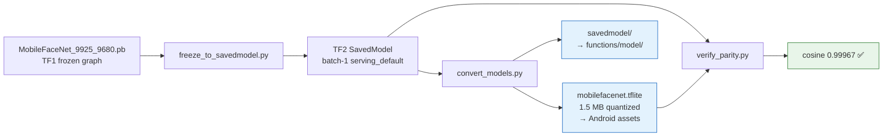
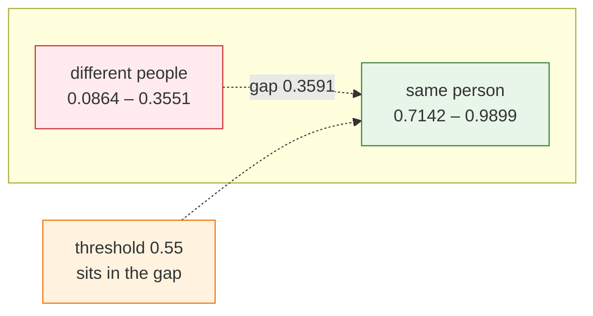
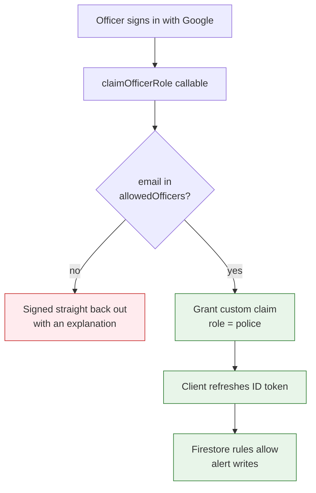

# Week 3 — Implementation & Model Validation

**Project:** NextGen Rakshak: Smart Edge-Based Lost Child Recovery System for Mass Gatherings
**Group ID:** 6
**Phase:** Implementation (following the Week 2 design)

> **Before submission:** fill in the week date range below.

**Week of:** `____________ to ____________`

---

## Summary

Week 2 produced the blueprint; this week we built against it and — critically —
put the face-recognition claim to the test with real measurements instead of
quoted figures.

The headline outcome is that the recognition pipeline now works end to end. We
sourced pretrained MobileFaceNet weights, built a reproducible conversion
pipeline that produces the device and server models from a *single* source, and
measured the system's actual accuracy on real photographs — which led us to
revise the match threshold on evidence rather than keep the figure we had
inherited from the literature.

Alongside this we completed the volunteer Android application against the Week 2
specification, finished the Cloud Functions, and reworked authentication across
both applications so that signing in and being *authorised* are no longer the
same thing. Reviewing the code also surfaced four defects: three in the
recognition path — one of which had silently disabled the entire offline mesh —
and one in the kiosk that would have let any Google account file or resolve
missing-child alerts.

This directly advances **Objective 2** (on-device detection and recognition in
real time), **Objective 7** (privacy and trust by design) and **Objective 8**
(validating the system's effectiveness rather than asserting it).

---

## 1. Face recognition model — the blocking dependency

Until this week the system could not recognise anyone: the code was complete but
no model weights existed, so no embedding had ever been computed.

### 1.1 Source

| Property | Value |
|---|---|
| Source | [sirius-ai/MobileFaceNet_TF](https://github.com/sirius-ai/MobileFaceNet_TF) |
| File | `arch/pretrained_model/MobileFaceNet_9925_9680.pb` (~5.9 MB) |
| Licence | Apache-2.0 |
| Reported accuracy | 99.25% on the LFW benchmark (encoded in the filename) |
| Input | `img_inputs` `[-1, 112, 112, 3]` |
| Output | `embeddings` `[-1, 128]`, **already L2-normalized by the graph** |

The graph's own output normalisation is convenient: because every embedding is a
unit vector, cosine similarity reduces to a dot product and needs no extra
normalisation step on the device.

### 1.2 Conversion pipeline

Weights are **not committed** to the repository (size and licensing). They are
regenerated by two scripts, so any team member can reproduce them:



```bash
pip install tensorflow
curl -L -o mobilefacenet.pb \
  https://raw.githubusercontent.com/sirius-ai/MobileFaceNet_TF/master/arch/pretrained_model/MobileFaceNet_9925_9680.pb
python scripts/freeze_to_savedmodel.py --pb mobilefacenet.pb --out ./mobilefacenet_savedmodel
python scripts/convert_models.py       --saved-model ./mobilefacenet_savedmodel
python scripts/verify_parity.py        --saved-model ./mobilefacenet_savedmodel
```

Dynamic-range quantisation shrinks the model from 5.9 MB to **1.5 MB** for the
phone. `verify_parity.py` then runs one input through both the quantized
`.tflite` and the source SavedModel and asserts they agree — measured
**cosine 0.99967**, confirming quantisation did not damage the embedding.

### 1.3 Architecture change — server loads the SavedModel directly

The Week 2 design had the Cloud Function load a TensorFlow.js `GraphModel`
converted from the same weights. We changed this: `tfjs-node` can load a
TensorFlow SavedModel directly, so the server now runs **the identical graph**
that was quantized for the device, eliminating a second conversion that could
drift from the first.

This also removed a hard blocker: `tensorflowjs_converter` cannot run on
Windows at all, because it imports `tensorflow_decision_forests`, which has no
Windows build. The SavedModel route makes the project set up cleanly on the
team's machines.

---

## 2. Measured accuracy — validating the design assumptions

Rather than restate the synopsis figures, we measured them. Nine photographs of
four people were run through the **actual quantized `.tflite`**, using the app's
own crop geometry — 36 pairs in total.

| Group | Pairs | Cosine range |
|---|---|---|
| Same person | 15 | **0.7142 – 0.9899** |
| Different people | 21 | **0.0864 – 0.3551** |
| **Separation gap** | | **0.3591** |



The model separates identities cleanly — no different-person pair came close to
any same-person pair.

### Revising the match threshold: 0.75 → 0.55

The measurement changed a design parameter. The two groups are separated by an
empty band running from **0.3551 to 0.7142**; any threshold inside that band
classifies all 36 pairs correctly. The synopsis figure of 0.75 sits *above* the
band — inside the same-person range — and therefore rejects genuine matches:

| Threshold | False matches | Missed matches |
|---|---|---|
| 0.75 (as designed in Week 2) | 0 / 21 | **5 / 15** |
| **0.55 (adopted)** | **0 / 21** | **0 / 15** |

We adopted **0.55**, which sits near the middle of the empty band with roughly
0.19 of headroom on each side, so it tolerates harder pairs than our sample
contains.

The asymmetry of the two error types justifies favouring the lower value. A
missed child is the precise failure this system exists to prevent. A false
candidate costs only the moment a volunteer takes to tap "Not a match" — and
because the design already requires every match to be human-confirmed before it
reaches police, false positives are cheap by construction while false negatives
are not.

This supersedes the 0.75 figure in the synopsis and in the Week 2 design
documents, which was taken from the literature before we had a model to measure.
The Week 2 documents are left unchanged as the record of the design as it stood
then; `Constants.SIMILARITY_THRESHOLD` and `scripts/README.md` carry the current
value and the evidence for it.

---

## 3. Volunteer Android application — completed to specification

The app was audited screen by screen against synopsis §6.2 and the gaps closed.

| Requirement | Work done |
|---|---|
| §6.2.3 / FR-04 — discard non-frontal faces | The head-Euler check was specified but **never applied**: the detector captured only roll and the matcher ignored it entirely. Now captures **yaw** (the dominant frontality signal) and filters before embedding — limits 30° yaw / 40° roll |
| §6.2.3 — scan overlay | Camera now overlays "Scanning for \<names\>…" |
| §6.2.4 / FR-07 — side-by-side comparison | Match dialog previously showed only the parent's photo. Now shows it beside the face captured live, each captioned, so the volunteer judges the images rather than trusting the score |
| §6.2.4 — vibrate on match | Added, as a double pulse distinct from a normal notification |
| §6.2.2 — time elapsed | Alert rows now show "12 min ago", refreshed every 30 s — the golden-hour clock was not previously on screen |
| §6.2.1 — permission rationale | Permissions were requested cold; a dialog now explains each one and states that matching is on-device and no bystander's face is uploaded |

---

## 4. Cloud backend

| Requirement | Work done |
|---|---|
| FR-03 — geofenced alerts | Push is now filtered by haversine distance to a 2 km radius. Fails **open**: a volunteer with no known location is still notified, because a missed nearby helper costs a child while a spurious notification costs one buzz |
| FR-12 — alert expiry | Reconciled to 8 hours across the Cloud Function, the mesh, and the synopsis (the server had 2 h) |
| NFR-08 — privacy | Resolving an alert cleared the embedding but left the child's photo in Cloud Storage indefinitely. An `onAlertResolved` trigger now deletes the photo and clears the embedding on the `active → resolved` transition, covering both the officer's manual resolve and the scheduled sweep |
| FR-14 — mesh routing | Added the TTL/hop-count the design specified: packets now carry a hop count that is decremented at each relay and dropped at zero, plus an expiry check |

---

## 5. Authentication and authorisation

Both applications signed people in, but neither checked whether the person was
allowed to do what they were about to do. This week separated the two concepts.

### 5.1 Volunteer app — "Continue with Google"

The app previously asked for a phone number in a text box and signed the device
in **anonymously**. A sighting sent to police therefore carried no identity: the
officer receiving it had no way to know who reported it, and nothing prevented
one person registering repeatedly. That is incompatible with the synopsis's
"trusted, pre-registered volunteer" model, on which the system's credibility
rests.

Volunteers now sign in with Google through **Credential Manager** — the current
API; the `GoogleSignIn` client it replaces is deprecated. The returned Google ID
token is exchanged for a Firebase session, and the volunteer's name and email are
stored with their role and written to `volunteers/{uid}`, so every match is
attributable to a real account. Sign-out, which did not exist at all, was added.

The phone-only path is retained behind a **"Continue without Google (demo)"**
link, labelled as creating an unverified account, so the app remains
demonstrable before OAuth is configured for the project.

### 5.2 Police kiosk — authentication was not authorisation

Reviewing the kiosk surfaced the most serious defect of the week.

The portal authenticated officers with Google but never checked **which** Google
account had signed in — so any account on the internet could reach the full
kiosk. Compounding it, `firestore.rules` permitted `alerts` create and update to
anyone satisfying `signedIn()`, and that includes every volunteer device, because
the app signs in anonymously. The practical consequence: a volunteer's phone, or
any stranger with a Google account, could file fabricated missing-child alerts or
mark genuine ones resolved.

Synopsis §6.1.1 had already specified the remedy — *"attaches a `role: police`
custom claim; Firestore security rules use this claim to gate write access to the
alerts collection"* — it had simply never been implemented. It now is:



| Principal | Signs in via | Permitted writes |
|---|---|---|
| Officer (kiosk) | Google **+** `allowedOfficers` entry → `police` claim | Create/resolve alerts; update match status |
| Volunteer (app) | Google (anonymous = demo fallback) | Own `volunteers/{uid}` doc; create matches |
| Any signed-in user | — | Nothing further; no client may delete anything |

Two design points worth noting:

- **The allow-list is invisible to clients.** `allowedOfficers` denies all client
  read and write, so it is reachable only by the Admin SDK inside the Cloud
  Function. A signed-in user can neither enumerate authorised officers nor add
  themselves.
- **The claim is re-checked on every auth state change,** not just at sign-in. A
  session restored on page reload never passes through the sign-in path, so
  checking only there would have left the hole open.

Firestore rules are the enforcement boundary; the kiosk's UI check is a
convenience on top of it.

## 6. Defects found by review

Three bugs were found by reading the recognition path end to end. The first was
serious.

**6.1 The offline mesh was silently carrying nothing.**
Alert timestamps were read from Firestore as epoch **seconds** while every
consumer treated them as **milliseconds**. The resulting age of every alert
computed to roughly 55 years, so the expiry check rejected *everything*:
broadcasting bailed out immediately and every received packet was dropped. The
offline path — a core contribution of the project — did nothing, with no error to
reveal it. Fixed, unit documented on the model, and pinned by a regression test.

**6.2 Device and server framed faces differently.**
Both sides squashed a raw detector box into the square 112×112 input, but the
device detects with ML Kit and the server with BlazeFace, whose boxes frame faces
differently — so the same child produced differently framed inputs, and
non-square boxes were distorted by an aspect-dependent amount. Against a fixed
threshold this systematically depressed true matches. Both sides now crop a
square centred on the box with a shared 0.2 margin.

**6.3 The model was reloaded and leaked on every scan.**
A new TFLite interpreter was constructed each time the scan screen opened, so the
model was re-read and the previous interpreter abandoned (nothing closes one).
Now a singleton, with 4 inference threads for the <200 ms budget and serialised
access, since TFLite interpreters are not thread-safe.

---

## 7. Build infrastructure

The Android module had `gradle-wrapper.properties` but no `gradlew`,
`gradlew.bat`, or `gradle-wrapper.jar`, so it could only be built from Android
Studio — no command-line build, no CI, and no way to run the unit tests. The
wrapper (Gradle 8.14, from the official repository at tag `v8.14.0`) is now
committed:

```bash
cd nextgen-rakshak-mobile
./gradlew :app:testDebugUnitTest   # compile + run unit tests
./gradlew :app:assembleDebug       # build the APK
```

---

## 8. Verification evidence

| Check | Result |
|---|---|
| `./gradlew :app:testDebugUnitTest` | **BUILD SUCCESSFUL** — 13 tests, 0 failures |
| `functions` `tsc --noEmit` | clean |
| `webportal` `tsc --noEmit` | clean |
| `verify_parity.py` | cosine **0.99967** (threshold 0.99) |
| Face separation measurement | gap **0.3591**, 0 false matches / 21 |

Not yet evidenced: server-side inference and both sign-in flows, all three
blocked on deployment or Firebase configuration rather than on code — see §9.

---

## 9. Known limitations

Stated plainly, because they bound what can currently be claimed:

1. **Server-side inference is not yet verified at runtime.** The `tfjs-node`
   native binding will not load on the development machine (local Node 22 vs the
   Node 20 that Cloud Functions pins). The code typechecks; confirm on first
   deploy that `onAlertCreated` logs `dims: 128`.
2. **Accuracy was measured on adult faces** from a public sample, not on children
   at a festival. The separation is wide enough to be encouraging, but the
   synopsis KPI (≥90% under festival lighting) remains unproven.
3. **Inference time has not been measured on a physical device**, so the <200 ms
   per-face target (NFR-03) is not yet evidenced.
4. **NFR-10 drift:** the synopsis states Android 5.0+ (API 21); the project sets
   `minSdk = 24`. The synopsis figure needs correcting.
5. **Neither sign-in flow has been exercised at runtime.** Both are blocked on
   configuration rather than code:
   - Google sign-in on the app needs an OAuth client, which exists only once the
     app's SHA-1 is registered in Firebase. The checked-in `google-services.json`
     currently has no `oauth_client` entry at all. The client therefore resolves
     the web client ID by name at runtime instead of referencing
     `R.string.default_web_client_id`, so the project still compiles and reports
     a clear "not configured" message rather than crashing.
   - The kiosk locks out **everyone**, including us, until at least one
     `allowedOfficers/{email}` document exists and the rules and function are
     deployed.

---

## 10. Next week (Week 4)

1. Run the app on physical devices and record real cosine scores and per-face
   inference times — closing limitations 2 and 3.
2. Deploy the Cloud Functions and confirm server-side embedding — closing
   limitation 1.
3. Finish the sign-in configuration and test both flows end to end: register the
   SHA-1 for Google sign-in on the app, and add an officer to `allowedOfficers`
   for the kiosk — closing limitation 5.
4. Multi-device mesh trial: verify multi-hop relay and TTL behaviour with three
   or more phones and no internet.
4. Begin the optional Raspberry Pi node if the above is stable.
